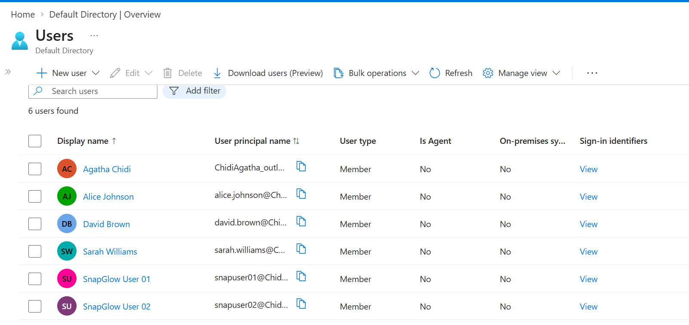
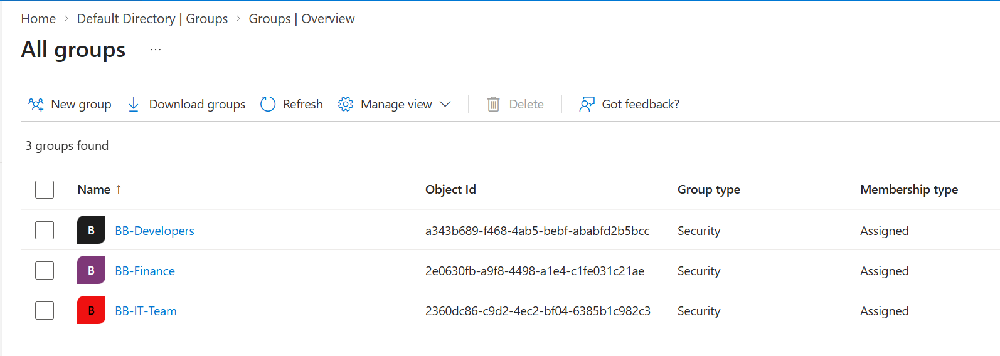
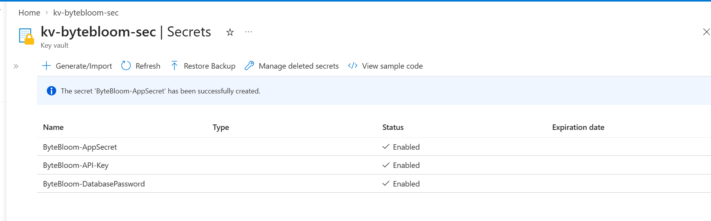

# ByteBloom — Azure Security & IAM Lab

A practical Azure security and identity lab built around a realistic small-business scenario for **ByteBloom**.

The project demonstrates how to design and implement identity, access control, secrets management, and least-privilege permissions using Microsoft Entra ID, Azure RBAC, Azure Key Vault, and Azure Storage.

## Project Scenario

ByteBloom is moving internal application resources to Azure and needs a simple security model that separates access by department while protecting sensitive application secrets.

The implementation focuses on:

- Centralized identity with Microsoft Entra ID
- Department-based users and security groups
- Azure RBAC and least-privilege access
- Secure application secrets with Azure Key Vault
- Controlled access to Azure Storage
- Permission boundaries between IT, Development, and Finance

## Architecture

```text
                    Microsoft Entra ID
                           |
              +------------+------------+
              |            |            |
           IT Team     Developers    Finance
              |            |            |
              +------------+------------+
                           |
                    Azure RBAC
                           |
              +------------+------------+
              |                         |
       Azure Key Vault            Azure Storage
       Application Secrets        Application Data
```

## Azure Resources

| Resource | Purpose |
|---|---|
| `RG-ByteBloom-Security` | Central resource group for the lab |
| Microsoft Entra ID | Identity and access management |
| Azure Key Vault | Secure storage of application secrets |
| Azure Storage Account | Application data storage |
| Azure RBAC | Role-based authorization |

## Identity & Access Model

### Entra ID Groups

- `BB-IT-Team` — IT administrators
- `BB-Developers` — application developers
- `BB-Finance` — finance users

Users are assigned to groups according to their department rather than granting permissions individually wherever possible.

### RBAC Model

| Team | Azure Role | Scope | Access Objective |
|---|---|---|---|
| IT | Contributor | Resource Group | Manage Azure resources |
| Developers | Storage Blob Data Contributor | Storage Account | Manage application data |
| Developers | Key Vault Secrets User | Key Vault | Read application secrets |
| Finance | Reader | Resource Group | View resources without modification |
| Finance | No Key Vault role | Key Vault | Prevent access to secrets |

This demonstrates **least privilege** by giving each team only the permissions required for its responsibilities.

## Key Vault

Azure Key Vault is used to protect application secrets instead of placing sensitive values directly in application configuration or source control.

Example lab secrets:

- `ByteBloom-DatabasePassword`
- `ByteBloom-API-Key`
- `ByteBloom-AppSecret`

> Secret values are intentionally not included in this repository.

## Security Controls Demonstrated

- Microsoft Entra identity management
- Group-based access control
- Azure RBAC
- Least-privilege authorization
- Key Vault secret management
- Storage data-plane permissions
- Separation of duties
- Resource-level access boundaries

## Access Validation

The lab includes permission checks designed to verify that the RBAC configuration works as intended.

Expected results:

- **IT** can manage resources within the assigned scope.
- **Developers** can work with storage and retrieve permitted Key Vault secrets.
- **Finance** can view the resource group but does not have access to Key Vault secrets.

The important part of the lab is not only assigning roles, but validating the resulting access boundaries.

## Screenshots

### Entra ID Users



### Entra ID Groups



### Azure Key Vault


### Key Vault Access Control (IAM)

%20key%20vault.png)

### Key Vault Secrets



### Storage Account Access Control (IAM)

%20storage.png)

## Skills Demonstrated

**Azure:** Microsoft Entra ID, Azure RBAC, Azure Key Vault, Azure Storage

**Identity & Security:** IAM, RBAC, least privilege, group-based access, secrets management, access validation

**Administration:** Resource organization, permission design, security testing, documentation

## What This Project Demonstrates

This project demonstrates practical Azure administration skills beyond basic resource creation. The focus is on **who can access what, at which scope, and why**.

It provides evidence of hands-on experience with identity management, authorization, secrets protection, and security-oriented Azure administration.

## Cost Considerations

The lab was designed for a personal Azure subscription using lightweight resources. Unnecessary resources should be removed after testing to avoid ongoing Azure charges.

## Repository Structure

```text
azure-bytebloom-security-iam/
├── README.md
└── screenshot/
    ├── access control (IAM) key vault.png
    ├── access control (IAM) storage.png
    ├── groups.png
    ├── key vaults.png
    ├── secrets.png
    └── users.png
```

## Author

**Agatha Nweze**

Azure Platform Engineering / Cloud Administration Portfolio

GitHub: [Acnweze](https://github.com/Acnweze)
